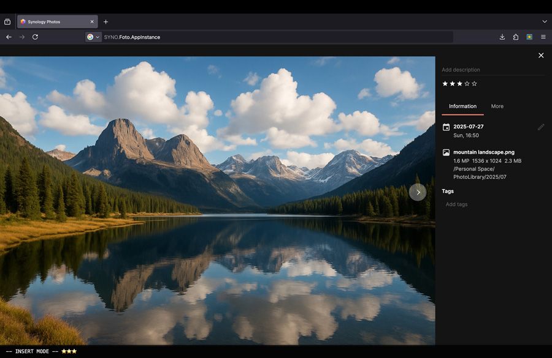

# Cull Pilot

Cull Pilot is a Vim-inspired browser extension that makes rating photos in 
**Synology Photos** fast and efficient. Star, navigate, and curate using 
just your keyboard — no mouse required.

Keyboard-first metadata assistant for Synology Photos — cull faster, 
tag smarter, and build dynamic albums.




## Features

- Press `i` to enter insert mode
- Use `0–5` to set star ratings (press the same key again or `0` to clear)
- Navigate photos with `h` (previous) and `l` (next)
- Press `Esc` to exit insert mode
- Overlay shows active mode and real-time feedback
- Automatically opens the info panel if needed


## Why Star Ratings Matter

If you're already using tools like **Lightroom**, you know the power of star ratings. In **Synology Photos**, these ratings can be used to:

- Build **criteria-based albums** (e.g. “4 stars and up”)
- Quickly sort through large batches of photos
- Filter and export only your best shots

Cull Pilot helps you apply those ratings **quickly and purposefully** — directly from the web interface.


## Tech Stack

Cull Pilot is built with:

- [Vite](https://vitejs.dev/) for development and bundling
- TypeScript for clarity and maintainability
- Web Extension APIs (Chrome/Firefox Manifest V3)
- DOM interaction via `content.js` (no frameworks)


## Build & Run from Source

If you'd like to build the extension locally, here’s how:

### 1. Clone the repo

```bash
git clone https://github.com/deadlypinfish/cullpilot.git
cd cullpilot
````

### 2. Install dependencies and build

```bash
npm install
npm run build
```

This creates a production-ready extension bundle in the `dist/` directory.

### 3. Load into Chrome (unpacked)

1. Visit `chrome://extensions`
2. Enable “Developer Mode” (toggle in top-right)
3. Click “Load unpacked”
4. Select the `dist/` folder from this project

See: [Official Chrome Guide](https://developer.chrome.com/docs/extensions/mv3/getstarted/#unpacked)


You can now open Synology Photos in a tab and start using keyboard shortcuts.


## Roadmap

* Tag editing in the info panel
* Configurable keybindings
* Album creation tools


## Contributing

Contributions, issues, and suggestions are welcome.

* File an [issue](https://github.com/deadlypinfish/cullpilot/issues)
* Submit a pull request
* Suggest new use cases

If you've built a custom fork for a different photo tool, let us know — we may support multiple platforms in the future.

## Support
If Cull Pilot saved you time or improved your workflow, you can support the project here

[](https://ko-fi.com/randomthingsdev)

## License

This project is licensed under the [MPL-2.0 license](LICENSE).

